# NetMind SOC Agent — System Architecture

> Open with **Markdown Preview Enhanced** in VSCode (`Ctrl+Shift+V`) to render diagrams.

---

## Full Data Flow

```mermaid
flowchart TD
    CSV["📄 CICIDS2018 CSV\n342 MB · up to 1.5M rows"]

    CSV --> A1

    subgraph INGEST["① INGESTION   src/data/data_ingest.py"]
        A1["Normalize columns · fill nulls · inf → 0"]
        A1 --> A2{"Artifact Filter"}
        A2 -->|"duration > 7 days\nOR proto=0 AND port=0\nAND packets=0"| A3["❌ DROP\nsensor noise / CSV garbage"]
        A2 -->|"Valid row"| A4["Synthetic IP\n— CICIDS strips real IPs —\nBenign label → 192.168.x.x\nAttack label → external routable IP"]
        A4 --> A5["Extract 33 ML features\nbytes · packets · duration\nratios · flags · bytes/sec"]
        A5 --> A6["Publish to Redis stream\nnetwork-flows\n{ flow_id · machine_ip · captured_at\n  label · dst_port · protocol · features }"]
    end

    A6 --> NS

    NS[("🔴 Redis Stream\nnetwork-flows\nmaxlen 100 000")]

    NS -->|"logger-group"| LOGGER
    NS -->|"classifier-group"| CLF
    NS -->|"profilers"| PROF

    subgraph LOGGER["② LOGGER   src/data/data_logger_worker.py"]
        L1["Write raw flow to PostgreSQL\nnetwork_flows table\nON CONFLICT DO NOTHING"]
        L1 --> L2["✓ ACK"]
    end

    subgraph PROF["③ PROFILER   src/data/data_profiler_worker.py"]
        P1["Update machine profile — Welford stats\nbytes · bytes/sec · byte ratio\npackets · duration · known ports/protocols"]
        P1 --> P8["Update request-type profile\nper machine per port\nHTTP · HTTPS · SSH · DNS …"]
        P8 --> P2{"flow_count ≥ 10?\ngraduation threshold"}
        P2 -->|"No — warming up"| P3["Redis cache only · TTL 1h"]
        P2 -->|"Yes — graduated"| P4["Persist to PostgreSQL\nmachine_profiles"]
        P4 --> P5{"flow_count % 100 == 0?"}
        P5 -->|"Yes"| P6["Generate RAG snapshot\nembed plain-English summary\nstore in machine_history\npgvector cosine similarity"]
        P5 -->|"No"| P7["✓ ACK"]
        P3 --> P7
        P6 --> P7
    end

    subgraph CLF["④ CLASSIFIER WORKER   src/data/data_classifier_worker.py"]
        C1["Fetch machine profile\nRedis → PostgreSQL → empty"]
        C1 --> C2["Fetch request-type profile\nRedis → PostgreSQL → population baseline"]
        C2 --> C3["POST features to\nclassifier:8001\nLightGBM · 33 features"]
        C3 --> C4["ML result\nlabel: 0=benign 1=suspicious 2=attack\nclassifier_score 0→1 · confidence"]
        C4 --> C5["score_flow\nrisk_score = 0.6 × classifier_score\n           + 0.4 × deviation_score\ndeviation = z-score vs machine baseline"]
        C5 --> C6{"compute_risk_level"}

        C6 -->|"flow_count < 10\nOR unknown protocol"| R1["HIGH  escalate ✓\nnew machine · no baseline yet"]
        C6 -->|"confidence low\nnot enough history"| R2["MEDIUM  escalate ✗"]
        C6 -->|"risk_score ≥ 0.80"| R3["CRITICAL  escalate ✓"]
        C6 -->|"risk_score ≥ 0.50\nOR deviation ≥ high_deviation"| R4["HIGH  escalate ✓"]
        C6 -->|"deviation ≥ low_deviation"| R5["MEDIUM  escalate ✗"]
        C6 -->|"all normal"| R6["LOW  escalate ✗"]

        R2 --> DISC["✓ ACK · not investigated\nprofiler still processed it"]
        R5 --> DISC
        R6 --> DISC

        R1 --> PUB_HR["Publish to high-risk-flows\n+ scoring payload"]
        R3 --> PUB_HR
        R4 --> PUB_HR
    end

    PUB_HR --> HS[("🔴 Redis Stream\nhigh-risk-flows\nmaxlen 10 000")]

    HS -->|"agent-group\n3 replicas"| AGENT

    subgraph AGENT["⑤ AGENT   src/agent/agent_service.py"]
        AG1["Load Redis session context\nprior flows for this IP · 30 min window"]
        AG1 --> GRD1{"🛡 Guardrail 1\nInput Check"}
        GRD1 -->|"Prompt injection detected\nOR field > 500 chars"| ESC_INJECT["Force escalate\nno LLM call"]
        GRD1 -->|"Clean"| AG2["Build investigation prompt\nmachine_ip · dst_port · protocol\nbytes · duration · risk signals\nsession history"]

        AG2 --> LLM_START

        subgraph LOOP["LLM Loop — budget: 5 tool calls · 90 seconds"]
            LLM_START["Call LLM\nPrimary:  Anthropic Claude Sonnet 4.6\nFallback: Groq llama-3.3-70b\nauto-switch on credit error HTTP 400"]
            LLM_START --> RESP{"stop_reason?"}
            RESP -->|"end_turn"| END_LOOP["Extract explanation\nbreak loop"]
            RESP -->|"tool_use"| TLOOP

            subgraph TLOOP["For each tool call"]
                GRD2{"🛡 Guardrail 2\nTool Call Check"}
                GRD2 -->|"OSINT on internal IP\nWrong firewall target\nNo escalation reason"| BLK["Blocked · return error to LLM"]
                GRD2 -->|"Approved"| EXEC{"tool name?"}

                EXEC -->|"rag_search"| T1["pgvector search\nmachine_history\n→ behavioral baseline"]
                EXEC -->|"lookup_ip_vt"| T2["VirusTotal\n90+ vendors\n→ malicious score"]
                EXEC -->|"lookup_ip_abuse"| T3["AbuseIPDB\ncommunity reports\n→ abuse confidence"]
                EXEC -->|"lookup_threats"| T4["AlienVault OTX\nattack campaigns\n→ threat actor"]
                EXEC -->|"whois_domain"| T5["WHOIS\ndomain age · registrar\n→ newly registered?"]
                EXEC -->|"lookup_ports"| T6["Shodan InternetDB\nopen ports · services\n→ attack surface"]
                EXEC -->|"generate_rule"| T7["Build iptables rule\niptables -A INPUT\n-s IP -p proto -j DROP"]
                EXEC -->|"escalate"| T8["Flag for human\nreason + priority stored"]

                T1 & T2 & T3 & T4 & T5 & T6 & T7 & T8 --> GRD3
                GRD3{"🛡 Guardrail 3\nResult Sanitize"}
                GRD3 -->|"Injection in result"| SAN["Sanitize · warn LLM"]
                GRD3 -->|"Clean"| RES["Return to LLM"]
                SAN --> RES
            end

            RES --> BUD{"Budget check\n5 calls OR 90s?"}
            BUD -->|"Under limit"| LLM_START
            BUD -->|"Hit"| FORCE["Force end_turn\nlimit_hit=True\nno firewall rule"]
            FORCE --> LLM_START
        end

        END_LOOP --> GRD4{"🛡 Guardrail 4\nFinding Check"}
        GRD4 -->|"HIGH+CRITICAL but\nbenign phrases in text\nOR BENIGN + rule\nOR limit_hit + rule"| FIX["Remove rule\nforce escalated_to_human=True"]
        GRD4 -->|"Consistent"| OK["Approved"]

        FIX --> WR
        OK  --> WR
        ESC_INJECT --> WR

        WR["Write PostgreSQL\nsecurity_alerts — finding\nflow_traces — step timeline\n  step_type · tool · args\n  result · duration_ms\n  guardrail_status"]
        WR --> SU["Update Redis session\ncontinuity across flows\nfrom same machine IP"]
    end

    WR --> DB

    DB[("🐘 PostgreSQL\nsecurity_alerts\nflow_traces\nnetwork_flows\nmachine_profiles\nmachine_history")]

    DB --> DASH

    subgraph DASH["⑥ DASHBOARD   src/dashboard/dashboard_main.py   :8501"]
        D1["Query DB · @st.cache_data ttl=10s\nrefresh every 10 seconds"]
        D1 --> D2["KPI strip\nFLOWS/24H · ALERTS/24H\nCRITICAL · ESCALATED · MACHINES"]
        D1 --> D3["Alert cards\nRisk · IP · Timestamp\nClassifier score · Deviation · Confidence\nTools used · Firewall rule"]
        D3 --> D4["Investigation Trace timeline\nML Classify → Input Guard\n→ Tool calls → Finding Guard"]
        D1 --> D5["Machine Profiles table\nflow count · first/last seen\nknown ports · protocols"]
    end
```

---

## Decision Points at a Glance

| # | Stage | Question | YES | NO |
|---|---|---|---|---|
| 1 | **Ingest** | Artifact? (impossible duration or zero-payload) | Drop row | Continue |
| 2 | **Classifier** | New machine? (flow_count < 10) | Force HIGH + escalate | Use ML score |
| 3 | **Classifier** | Low ML confidence? | MEDIUM · no escalate | Apply score thresholds |
| 4 | **Classifier** | risk_score ≥ 0.80? | CRITICAL + escalate | Next check |
| 5 | **Classifier** | risk_score ≥ 0.50 OR high deviation? | HIGH + escalate | Next check |
| 6 | **Classifier** | deviation ≥ low threshold? | MEDIUM · no escalate | LOW · no escalate |
| 7 | **Guardrail 1** | Injection / oversized field in flow data? | Force escalate · skip LLM | Build prompt |
| 8 | **Guardrail 2** | Tool call invalid (wrong target / args)? | Block · send error to LLM | Execute tool |
| 9 | **Guardrail 3** | Injection pattern in tool result? | Sanitize + warn LLM | Pass through |
| 10 | **LLM** | Anthropic credit error (HTTP 400)? | Switch to Groq · retry | Stay on Anthropic |
| 11 | **LLM Budget** | 5 tool calls used OR 90s elapsed? | Force end · limit_hit=True | Continue loop |
| 12 | **Guardrail 4** | Finding contradicts evidence? | Remove rule · force escalate | Approve finding |

---

## Component Map

| Container | Reads from | Writes to |
|---|---|---|
| `logger` | `network-flows` (logger-group) | `network_flows` table |
| `profiler` | `network-flows` (profilers) | `machine_profiles`, `machine_history`, Redis |
| `classifier-worker` | `network-flows` (classifier-group) | `high-risk-flows` stream |
| `classifier` service | HTTP POST | — |
| `guardrails` service | HTTP POST | — |
| `agent-worker` × 3 | `high-risk-flows` (agent-group) | `security_alerts`, `flow_traces` |
| `dashboard` | PostgreSQL (read-only) | — |

---

## Key Thresholds

| Parameter | Value | File |
|---|---|---|
| Machine graduation threshold | 10 flows | `profiles_machine.py` |
| RAG snapshot interval | every 100 flows | `profiles_machine.py` |
| Profile Redis TTL | 1 hour | `profiles_machine.py` |
| Session context TTL | 30 minutes | `agent_service.py` |
| Agent tool call budget | 5 calls | `agent_service.py` |
| Agent time budget | 90 seconds | `agent_service.py` |
| Dashboard cache TTL | 10 seconds | `dashboard_main.py` |
| Artifact max duration | 7 days | `data_ingest.py` |
| Stream max length — flows | 100 000 | `data_consumer.py` |
| Stream max length — high risk | 10 000 | `data_consumer.py` |
